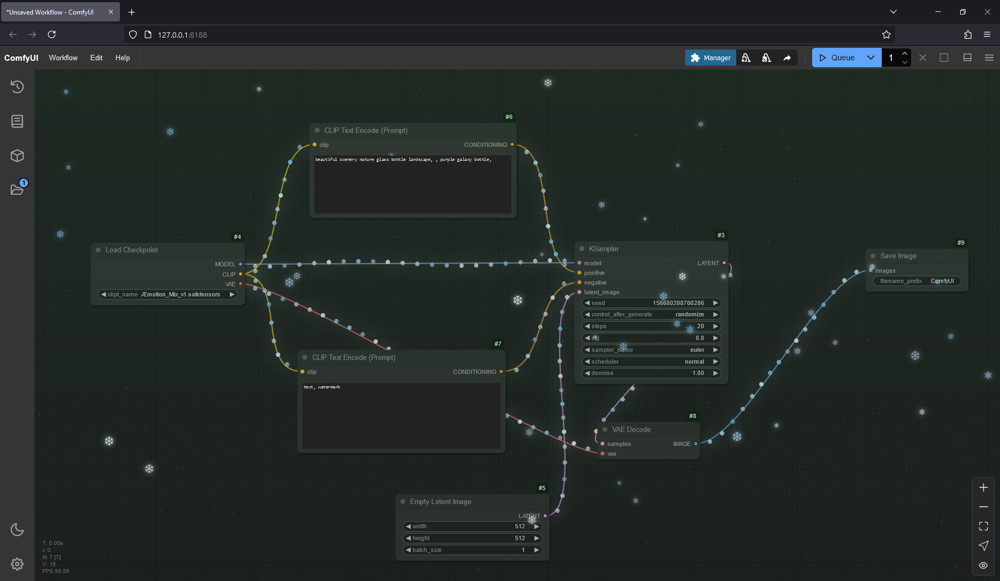

<div align="center">

# 🎄 ComfyUI Christmas Theme ✨

**Transform your ComfyUI workspace into a winter wonderland**

[](https://github.com/comfyanonymous/ComfyUI)
[](pyproject.toml)
[](LICENSE)
[](https://github.com/AEmotionStudio/ComfyUI-ChristmasTheme/releases)


*Dynamic backgrounds • Animated snowfall • Festive node connections*

</div>

---

## 📢 Latest Update — December 25, 2025

### 🚀 Performance Overhaul v1.1.0

Major performance optimizations and bug fixes for a smoother experience:

| Change | Description |
|--------|-------------|
| ⚡ **Adaptive Performance** | Auto-adjusts visual quality based on your FPS (3 tiers: normal/warning/critical) |
| 🔧 **Settings API Fix** | Eliminated ~367,000 console deprecation warnings |
| 🎯 **Visibility Detection** | Automatically pauses animations when tab is hidden |
| 🧹 **Pure DOM Snowflakes** | Removed React dependency for lighter, faster snow effects |
| 📱 **Device-Aware** | Snowflake count adapts to device capability (25-60 flakes) |
| 🎨 **Gradient Caching** | Background themes now cache gradients for faster rendering |
| 🔢 **Sin Lookup Table** | Pre-computed trigonometry for twinkle effects |
| ♻️ **Object Pooling** | Reuses memory allocations to reduce garbage collection |

---

## ✨ Features

<table>
<tr>
<td width="50%">

### 🎄 Christmas Node Links


- Animated light effects along connections
- **6 color schemes**: Traditional, Warm White, Cool White, Multicolor, Pastel, New Year's Eve
- **3 animation styles**: Steady, Gentle Twinkle, Sparkle
- Adjustable size, glow, and flow direction
- Multiple link styles (spline, straight, linear, hidden)

</td>
<td width="50%">

### ❄️ Snowfall Effect


- Smooth CSS-based snowflake animations
- **5 color options**: White, Ice Blue, Rainbow, Match Theme, New Year's
- Adjustable glow intensity
- GPU-accelerated rendering
- Auto-scales based on device performance

</td>
</tr>
<tr>
<td width="50%">

### 🌌 Dynamic Backgrounds


- Animated starry night sky
- **6 atmospheric themes**:
  - 🌌 Classic Night
  - 🎄 Christmas Forest
  - 🍬 Candy Cane Red
  - ❄️ Frost Night
  - 🍪 Gingerbread
  - 🌑 Dark Night

</td>
<td width="50%">

### ⚡ Performance Features

- **Adaptive quality** — auto-reduces effects when FPS drops
- **Smart pausing** — animations freeze during workflow execution
- **Tab detection** — pauses when browser tab is hidden
- **Device-aware** — adjusts to hardware capabilities
- **Object pooling** — minimizes memory allocation
- **Cached gradients** — avoids recreating colors each frame

</td>
</tr>
</table>

---

## 📦 Installation

### Option 1: ComfyUI Manager (Recommended)
Search for "Christmas Theme" in ComfyUI Manager and click Install.

### Option 2: Git Clone
```bash
cd ComfyUI/custom_nodes
git clone https://github.com/AEmotionStudio/ComfyUI-ChristmasTheme
```

### Option 3: Manual Download
Download the [latest release](https://github.com/AEmotionStudio/ComfyUI-ChristmasTheme/releases) and extract to `ComfyUI/custom_nodes/`

After installation, **restart ComfyUI** to load the extension.

---

## ⚙️ Settings

All settings are accessible via **ComfyUI Settings → Christmas Theme**

<details>
<summary><b>🎄 Christmas Effects</b></summary>

| Setting | Options | Default |
|---------|---------|---------|
| Christmas Lights | On / Off | On |
| Color Scheme | Traditional, Warm White, Cool White, Multicolor, Pastel, New Year's Eve | Traditional |
| Light Effect | Steady, Gentle Twinkle, Sparkle | Gentle Twinkle |
| Light Size | 1 - 10 | 3 |
| Glow Intensity | 0 - 30 | 20 |
| Flow Direction | Forward / Reverse | Forward |
| Link Style | Spline, Straight, Linear, Hidden | Spline |

</details>

<details>
<summary><b>🌌 Background Theme</b></summary>

| Setting | Options | Default |
|---------|---------|---------|
| Background Effect | On / Off | On |
| Color Theme | Classic Night, Christmas Forest, Candy Cane Red, Frost Night, Gingerbread, Dark Night | Classic |

</details>

<details>
<summary><b>❄️ Snow Effect</b></summary>

| Setting | Options | Default |
|---------|---------|---------|
| Snow Effect | On / Off | On |
| Snowflake Color | White, Ice Blue, Rainbow, Match Theme, New Year's | White |
| Snowflake Glow | 0 - 20 | 10 |

</details>

<details>
<summary><b>⚡ Performance</b></summary>

| Setting | Options | Default |
|---------|---------|---------|
| Pause During Render | Enabled / Disabled | Enabled |

</details>

---

## 🔧 Technical Details

| Component | Technology |
|-----------|------------|
| Snowflakes | Pure DOM + CSS animations (GPU-accelerated) |
| Background | Canvas 2D with gradient caching |
| Node Links | Canvas override with adaptive rendering |
| Settings | Centralized cache with onChange callbacks |

**Performance optimizations include:**
- O(1) frame time averaging
- Pre-allocated object pools
- Sin lookup tables for animations
- Page Visibility API integration
- Device capability detection

---

## 🤝 Contributing

Contributions are welcome! Whether it's bug reports, feature suggestions, or pull requests, your help is appreciated.

---

## 🔗 Connect with Æmotion (Developer)
-   YouTube: [AEmotionStudio](https://www.youtube.com/@aemotionstudio/videos)
-   GitHub: [AEmotionStudio](https://github.com/AEmotionStudio)
-   Discord: [Join our community](https://discord.gg/UzC9353mfp)
-   Website: [aemotionstudio.org](https://aemotionstudio.org/)

## ☕ Support
If you find this project useful and wish to support its development, consider:

[](https://ko-fi.com/aemotionstudio)

Your support helps dedicate more time to maintaining and improving this project, developing new features, and creating better documentation and tutorials.

---

<div align="center">

*Happy Holidays! 🎄*

</div>
